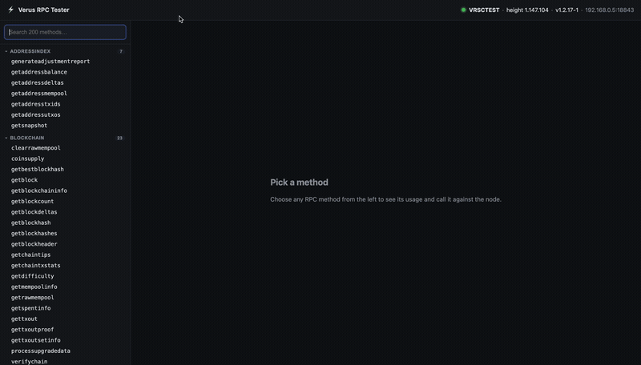

# Verus RPC Tester

A small web UI for interactively calling **every** `verusd` JSON-RPC method against a
running node. Pick a method from the categorized list, read its `help`, pass positional
params as a JSON array, and inspect the response — with full amount precision preserved.

Built on the [`verus-rpc`](https://www.npmjs.com/package/verus-rpc) client.



<sub>Playback is ~2x. For a sharper version, see [`assets/demo.mp4`](assets/demo.mp4).</sub>

## Features

- **Every method, self-documenting.** The list is pulled from the daemon's own `help`
  command and grouped by category; per-method docs come from `help <method>`.
- **No float rounding.** Amounts round-trip through `lossless-json`, so `0.00000001`
  stays exact end to end.
- **Credentials stay server-side.** The browser only ever talks to this app's `/api`;
  the RPC password never reaches the client, error messages, or the copy-as-curl snippet.
- **Guardrails on mutating calls.** State-changing methods (`sendcurrency`,
  `encryptwallet`, `stop`, …) prompt for confirmation before they run.
- **Copy as curl.** Reproduce any call from the terminal with one click.

## Quick start

> Requires **Node 20.6+** (for the built-in `--env-file`).

```bash
npm install
cp .env.example .env    # fill in the daemon URL + rpcuser/rpcpassword
npm run dev             # API on :8787, Vite dev server on :5173
```

Then open **http://localhost:5173**.

## Configuration

All config lives in `.env` (gitignored). Values come from the daemon's config file, e.g.
`~/.komodo/vrsctest/vrsctest.conf`.

| Variable          | Required | Default     | Description                                          |
| ----------------- | :------: | ----------- | ---------------------------------------------------- |
| `VERUS_RPC_URL`   |    ✓     | —           | Daemon JSON-RPC endpoint, e.g. `http://localhost:18843` |
| `VERUS_RPC_USER`  |    ✓     | —           | `rpcuser` from the daemon config                     |
| `VERUS_RPC_PASS`  |    ✓     | —           | `rpcpassword` from the daemon config                 |
| `HOST`            |          | `0.0.0.0`   | Bind address — `0.0.0.0` for LAN, `127.0.0.1` for local only |
| `PORT`            |          | `8787`      | Server port                                          |

The daemon must allow this app's host in its `rpcallowip`. The server fails fast at
startup if any required variable is missing.

## Scripts

| Command             | What it does                                                        |
| ------------------- | ------------------------------------------------------------------ |
| `npm run dev`       | API (`:8787`) + Vite dev server (`:5173`, `/api` proxied) with watch |
| `npm run build`     | Build the SPA and compile the server to `dist/`                    |
| `npm start`         | Serve the built SPA + API from a single process                    |
| `npm run typecheck` | Type-check the server and web projects (no emit)                   |

### Production

```bash
npm run build
npm start               # serves UI + API on one port
```

Then open **http://&lt;host&gt;:8787**.

## How it works

```
Browser  →  Express backend (holds RPC credentials, uses verus-rpc)  →  verusd
```

`verusd` sends no CORS headers and `verus-rpc` is a server-side client, so a proxy is
required regardless — and that proxy is what keeps credentials off the client. The
backend is the only thing that knows the RPC password; the browser only talks to `/api`.

### API

| Method & path             | Purpose                                                          |
| ------------------------- | ---------------------------------------------------------------- |
| `GET  /api/status`        | Connection banner — chain, block height, version (no creds)      |
| `GET  /api/methods`       | Full method list grouped by category, each tagged dangerous/not  |
| `GET  /api/help/:method`  | `help <method>` text for one method                              |
| `POST /api/call`          | Run a method: `{ method, params[] }` → lossless-serialized result |

`POST /api/call` returns `ok: true` with the result, or `ok: false` with a client-safe
`{ code, message }` for RPC-level errors — those are expected results of testing, so they
come back as HTTP 200, not server faults.

## Safety

- **Testnet-oriented.** Every method is callable, including mutating ones. Methods that
  move funds or change wallet/chain/daemon state show a **confirmation dialog** first.
  `stop` shuts the daemon down until it is manually restarted.
- **`HOST=0.0.0.0` exposes the daemon to your LAN** — anyone on the network can drive it
  through this UI. Bind to `127.0.0.1` if you don't want that.
- **Credentials never leave the server.** They live only in `.env` and never appear in
  the status banner, error messages, or the copy-as-curl snippet (which uses
  `$RPC_USER:$RPC_PASS` placeholders).

## Project layout

```
server/                 Express backend
  index.ts              API routes + static SPA in prod
  verus.ts              VerusClient built from env (fails fast on missing config)
  help.ts               parses `help` output into categories (cached)
  dangerous.ts          denylist of confirm-gated methods
web/                    React + Vite SPA
  src/App.tsx           orchestration
  src/api.ts            typed fetch wrappers for /api
  src/components/        StatusBar, Sidebar, MethodPanel, ResultView, ConfirmDialog, History
```
